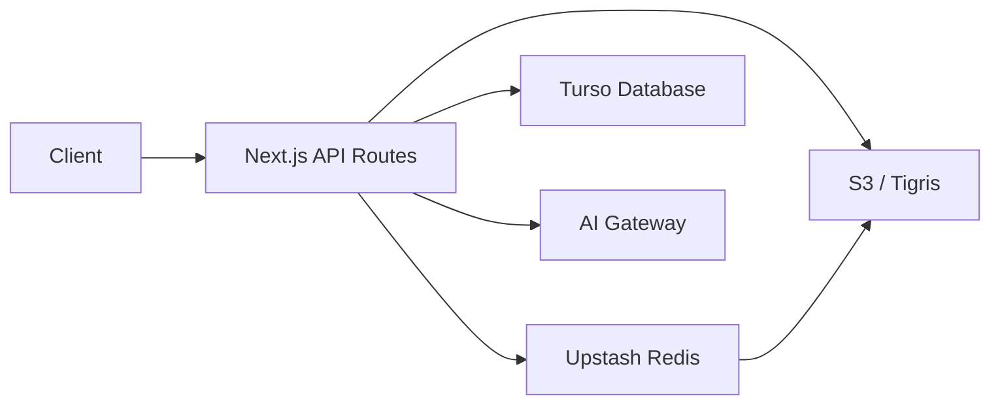

## Your Knowledge Base, Reimagined

Personal Notes is a Next.js-powered markdown vault that combines the best of local-first editing with cloud-backed storage. Write, organize, and explore your notes with AI assistance, all while maintaining complete control over your data.

### Built on Modern Infrastructure

- **S3-Compatible Storage**: Your notes live in Tigris S3, accessible from anywhere
- **Cached File Tree**: Instant navigation with prebuilt manifests and Redis caching
- **AI-Powered**: Context-aware chat and writing assistance using Vercel AI SDK
- **Rich Markdown**: BlockNote editor with live preview and Mermaid diagrams
- **Secure Authentication**: GitHub OAuth via BetterAuth with allowlist control

## Core Features

<CardGroup cols={2}>
  <Card
    title="File Management"
    icon="folder-tree"
    href="/features/file-management"
  >
    Navigate, create, rename, and organize markdown files with a responsive tree sidebar and context menus.
  </Card>
  
  <Card
    title="Markdown Editor"
    icon="pen-to-square"
    href="/features/markdown-editor"
  >
    Edit with BlockNote's rich interface, preview with Streamdown, and render Mermaid diagrams inline.
  </Card>
  
  <Card
    title="AI Assistance"
    icon="sparkles"
    href="/features/ai-assistance"
  >
    Improve writing, summarize content, expand ideas, or chat with AI about your current document.
  </Card>
  
  <Card
    title="Smart Caching"
    icon="bolt"
    href="/storage/caching-strategy"
  >
    Multi-layer cache with Upstash Redis and Next.js incremental cache for instant file loading.
  </Card>
</CardGroup>

## Quick Links

<CardGroup cols={3}>
  <Card
    title="Get Started"
    icon="rocket"
    href="/quickstart"
  >
    Set up your vault and create your first note in minutes
  </Card>
  
  <Card
    title="Installation Guide"
    icon="download"
    href="/installation"
  >
    Complete setup with all prerequisites and environment variables
  </Card>
  
  <Card
    title="API Reference"
    icon="code"
    href="/api/fs/list"
  >
    Explore the filesystem, tree, and AI API endpoints
  </Card>
</CardGroup>

## Architecture Highlights

Personal Notes follows a modern, performance-focused architecture:



**Key Components:**

- **Frontend**: React 19, Tailwind v4, Radix UI, BlockNote editor
- **Backend**: Next.js 16 App Router with server-side API routes
- **Storage**: S3-compatible (Tigris) for markdown files and manifest
- **Cache**: Upstash Redis for cluster-wide manifest and file content cache
- **Database**: Turso (LibSQL) for user sessions and metadata
- **AI**: Vercel AI SDK with configurable models (Google Gemini by default)

<Note>
  All S3 credentials and secrets remain server-side. The client never directly accesses your storage or API keys.
</Note>

## What Makes It Different?

<AccordionGroup>
  <Accordion title="Instant Tree Navigation">
    Instead of scanning your entire S3 bucket on every load, Personal Notes uses a **prebuilt manifest** (`file-tree.json`) that gets cached in Redis. Your file tree appears instantly, even with thousands of notes.
  </Accordion>
  
  <Accordion title="AI That Knows Your Context">
    The AI chat sidebar automatically includes your current document's content. Ask questions, request summaries, or get writing suggestions—all grounded in what you're working on right now.
    
    ```typescript
    // From app/api/ai/chat/route.ts
    const systemPrompt = 
      "You are an expert writing assistant working inside a Markdown knowledge base. "
      + "Answer as a collaborative teammate: be concise, reference the provided context, "
      + "and keep formatting clean.";
    ```
  </Accordion>
  
  <Accordion title="Progressive Web App">
    Install Personal Notes as a PWA on desktop or mobile. The service worker provides a native app experience with offline-ready architecture (optional caching strategies can be extended).
  </Accordion>
  
  <Accordion title="Secure by Default">
    - GitHub OAuth with explicit allowlist (`GH_ALLOWED_LOGIN`)
    - Secret redaction in AI context to prevent credential leaks
    - ETag-based optimistic locking to prevent conflicting edits
    - Server-side validation for all file operations
  </Accordion>
</AccordionGroup>

## Use Cases

**Personal Knowledge Management**  
Build a second brain with AI-assisted note-taking, context-aware search, and fluid organization.

**Technical Documentation**  
Maintain internal wikis with Mermaid diagrams, code blocks with syntax highlighting, and collaborative editing.

**Research & Writing**  
Draft articles, research papers, or blog posts with AI summaries, expansions, and grammar improvements.

**Project Notes**  
Organize project documentation with folder hierarchies, markdown tables, and version-tracked changes.

---

<Card
  title="Ready to start?"
  icon="rocket"
  href="/quickstart"
  horizontal
>
  Follow the quickstart guide to set up your vault and create your first note.
</Card>
